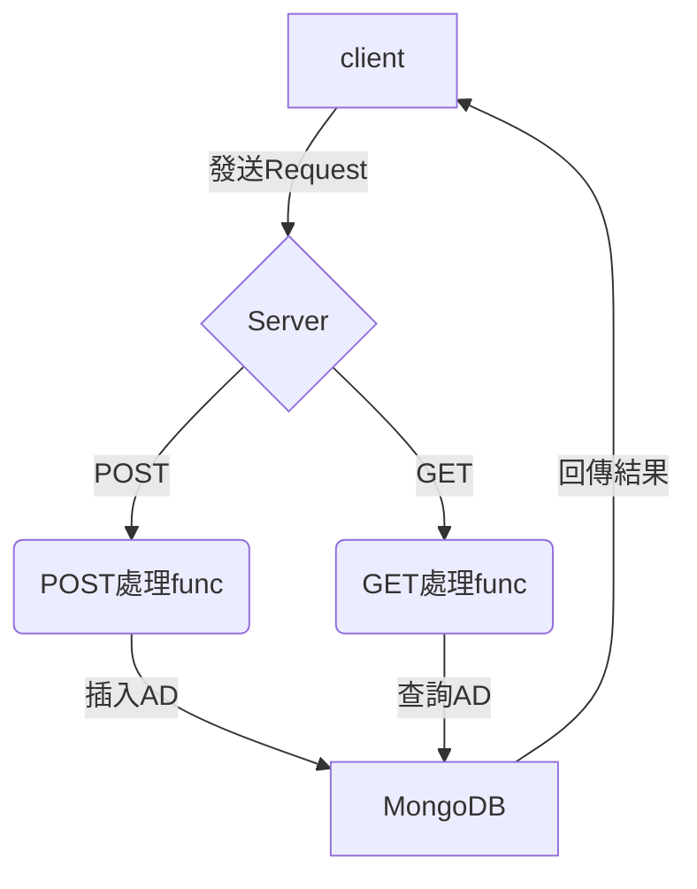

# Advertising-System

## Project 名稱 & 概述

這是一個“**廣告投放服務**”。主要提供廣告的儲存（POST）以及和廣告的提取（GET）。服務核心使用了Golang的Gin框架，並搭配MongoDB作為儲存資料庫。

選擇使用Gin框架的原因：

1. 強大效能：Gin框架的底層本身就是由Golang撰寫，使其具有出色的效能以及強大的並發處理能力。同時Gin框架本身就已經經過優化，能夠在單位時間內有效的處理大量的請求。
2. 網路資源：Gin框架是一個開源的項目，擁有活躍的社區以及廣泛的使用者經驗基礎，可以迅速的找到相關的教程以及問題解答等資源。
3. 迅速開發：Gin為成熟的框架，可以減少重複建構底層基礎的過程，更能夠著重於應用的需求邏輯，使開發更加迅速、方便。

選擇使用MongoDB的原因：

1. 數據模型：MongoDB是一個文檔導向的數據庫，使用類似JSON的BSON格式存儲數據。而從提供的範例裡面也可以明顯看出需要儲存的廣告也是類似JSON的文檔格式，因此在這個部分我第一選擇MongoDB作為資料庫使用。
2. 可擴展性：在廣告中像是Country的參數，可能會包含未知數量的國家，使用MongoDB的文檔型儲存資料庫可以很好的解決未知長度檔案儲存的操作，若使用其他關聯式資料庫會增加開發時撰寫的複雜性（可能需要很多table來儲存一筆廣告）。
3. 高發效能：MongoDB能夠處理大量的並發查詢和寫入操作。它支持索引、查詢優化等功能，可以提高查詢效率和數據存取速度。
4. 多元查詢：MongoDB提供了豐富的查詢語言和操作符，可以輕鬆的執行各種複雜的查詢操作，適用於此投放服務每一次GET有不同需求的操作。

## 架構



在上圖可以清楚的看到除了client之外，分為三層結構：

1. Server：這是主程式的入口（主資料夾路徑下的main.go）。
2. POST處理func / GET處理func：此為process package下的兩個主要處理POST / GET Requests的function（主資料夾路徑下的process package）。
3. MongoDB：這個是包含在storage package的部分，負責MongoDB的初始化連接，以及在MongoDB上的插入廣告和查詢廣告功能（主資料夾路徑下的storage package）。

## 版本需求 & 運行方法

作業系統：Ubuntu 22.04.4 LTS
Golang版本：go1.22.0 linux/amd64
MongoDB版本：mongod - v7.0.6

1. 確認需要運行MongoDB的主機並更改project.conf裡面的主機位置資訊。
2. 運行以下命令確認MongoDB的伺服器開始運行並設定要儲存的Database以及Collection，同時會tidy所需要的go module（這裡默認MongoDB運行的主機與接下來運行Server的主機為同一主機）。

    ```bash
    $ ./bash_setMongodbAndGoEnv.sh
    ==> Finish
    ```

3. 在新的終端機視窗運行以下命令開啟server。

    ```bash
    $ go run main.go
    ==> [GIN-debug] POST   /api/v1/ad                --> dcard/process.ProcessPost (3 handlers)
    ==> [GIN-debug] GET    /api/v1/ad                --> dcard/process.ProcessGet (3 handlers)
    ==> [GIN-debug] [WARNING] You trusted all proxies, this is NOT safe. We recommend you to set a value.
    Please check https://pkg.go.dev/github.com/gin-gonic/gin#readme-don-t-trust-all-proxies for details.
    ==> [GIN-debug] Environment variable PORT is undefined. Using port :8080 by default
    ==> [GIN-debug] Listening and serving HTTP on :8080
    ```

4. 在另外一個終端機中運行POST指令(hostname需替換成運行server的主機地址)。

    ```bash
    $ curl -X POST -H "Content-Type: application/json" \
    "http://127.0.0.1:8080/api/v1/ad" \
    --data '{
    "title": "AD 66",
    "startAt": "2023-12-10T03:00:00.000Z",
    "endAt": "2024-06-21T16:00:00.000Z",
    "conditions": [
    {
    "ageStart": 20,
    "ageEnd": 30,
    "gender": ["F"],
    "country": ["TW", "JP"],
    "platform": ["android", "ios"]
    }
    ]
    }'
    ==> {"AD 66":"POST successfully"}
    ```

5. 在另外一個終端機中運行GET指令(hostname需替換成運行server的主機地址)。

    ```bash
    $ curl -X GET -H "Content-Type: application/json" \
    "http://127.0.0.1:8080/api/v1/ad?offset=1&limit=1&age=25&gender=F&country=TW&platform=ios"
    ==> {"items":[{"title":"AD 66","endAt":"2024-06-21T16:00:00Z"}]}
    ```

## 功能介紹 & 函數解釋

+ **main.go**
  + **main()**：設定log寫入路徑、註冊在路徑"/api/v1/ad"下的POST \ GET兩個路由function
+ **process package**
  + **post.go**
    + **ProcessPost()**：首先將廣告資料儲存為json格式，同時確認廣告標題以及開始時間和結束時間是否符合要求（非空），最後呼叫storage package的StorageData函數將廣告插入資料庫，並返回成功或是失敗的資訊給client。
  + **get.go**
    + **ProcessGet()**：先分析需要查找的廣告條件儲存為一個structure，再呼叫storage package的QueryData函數來查詢所有符合的廣告，並返回符合條件的廣告標題和結束時間。
+ **storage package**
  + **mongo_basic.go**
    + **SetUri()**：讀取config檔案中MongoDB的主機位置 \ database name \ collection name，並返回這三個資料。
    + **NewMgoClient()**：設定一個新的MongoDB客戶端，透過ping()確認可以連接，並返回此客戶端。
    + **CloseMongoDB()**：關閉MongoDB客戶端。
    + **InsertOneRecord()**：具體底層實現將廣告插入MongoDB的操作函數。
  + **mongo_func.go**
    + **StoreData()**：上層實現POST儲存廣告進資料庫的函數。
    + **QueryData()**：根據GET的廣告條件，設定查詢的filter，最後根據filter返回資料庫中符合條件的所有廣告。
    + **printLogPostRequest()**：在log中記錄POST的請求內容和執行結果。
    + **printLogGetRequest()**：在log中記錄GET的請求內容和執行結果。

## 單元測試

於process package以及storage package下分別運行：

```bash
/process$ go test
PASS
ok      dcard/process   0.029s
```

```bash
/storage$ go test
PASS
ok      dcard/storage   0.680s
```

+ **process package**
  + **mongo_basic_test.go**
    + **TestSetUri()**：測試從conf檔案引入的資料是否正確。
    + **TestNewMgoClient()**：測試是否可以成功建立並返回一個MongoDB的客戶端。
    + **TestCloseMongoDB()**：測試是否可以成功關閉客戶端連線。
    + **TestInsertOneRecord()**：測試是否可以正確的插入一筆廣告資料。
  + **mongo_func_test.go**
    + **TestStoreData()**：測試是否可以正常對資料庫插入一筆廣告資料。
    + **TestQuery_Offset()**：測試是否可以返回正確offset的廣告查詢結果。
    + **TestQuery_Offset_TooMuch()**：測試當offset超過查詢結果的數量時是否返回錯誤訊息。
    + **TestQuery_Limit()**：測試是否可以返回正確的廣告查詢數量結果。
    + **TestQuery_Sort()**：測試返回的廣告是否有按照結束時間排序。
    + **TestQueryData_Age_NoLimitInQuery()**：測試query時無限制年齡的情況。
    + **TestQueryData_Age_NoLimitInDB()**：測試資料庫中無限制年齡的結果。
    + **TestQueryData_Age_BeforeStart()**：測試在年齡的query filter是否正常。
    + **TestQueryData_Age_BetweenStartAndEnd()**：測試在年齡的query filter是否正常。
    + **TestQueryData_Age_AfterEnd()**：測試在年齡的query filter是否正常。
    + **TestQueryData_Gender_NoLimitInQuery()**：測試query時無限制性別的情況。
    + **TestQueryData_Gender_NoLimitInDB()**：測試資料庫中無限制性別的結果。
    + **TestQueryData_Gender_ConditionInTestData()**：測試在性別的query filter是否正常。
    + **TestQueryData_Gender_ConditionNotInTestData()**：測試在性別的query filter是否正常。
    + **TestQueryData_Country_NoLimtInQuery()**：測試query時無限制國家的情況。
    + **TestQueryData_Country_NoLimtInDB()**：測試資料庫中無限制國家的結果。
    + **TestQueryData_Country_ConditionInTestData()**：測試在國家的query filter是否正常。
    + **TestQueryData_Country_ConditionNotInTestData()**：測試在國家的query filter是否正常。
    + **TestQueryData_Platform_NoLimtInQuery()**：測試query時無限制平台的情況。
    + **TestQueryData_Platform_NoLimtInDB()**：測試資料庫中無限制平台的結果。
    + **TestQueryData_Platform_ConditionInTestData()**：測試在平台的query filter是否正常。
    + **TestQueryData_Platform_ConditionNotInTestData()**：測試在平台的query filter是否正常。
+ **storage package**
  + **post_test.go**
    + **TestProcessPost_Title()**：測試是否有設定Title（不為空）。
    + **TestProcessPost_StartTime()**：測試是否有設定StartTime（不為空）。
    + **TestProcessPost_EndTime()**：測試是否有設定EndTime（不為空）。
    + **TestProcess_Success()**：測試正確的POST情況。
  + **get_test.go**
    + **TestProcessGet_Offset_OutRange()**：測試offset設定不在1～100的範圍內時有返回錯誤訊息。
    + **TestProcessGet_Offset_InRange()**：測試offset設定在1～100的情況。
    + **TestProcessGet_Limit_OutRange()**：測試limit設定不在1～100的範圍內時有返回錯誤訊息。
    + **TestProcessGet_Limit_InRange()**：測試limit設定在1～100的情況。
  
